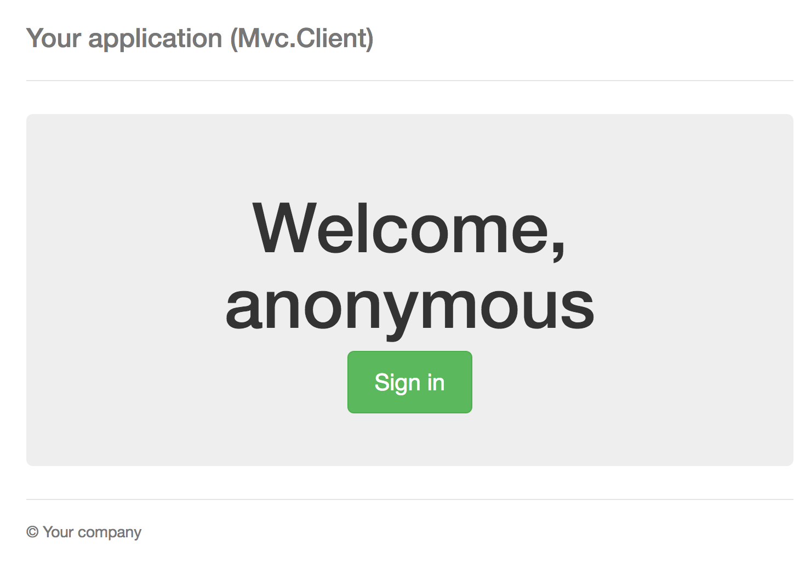
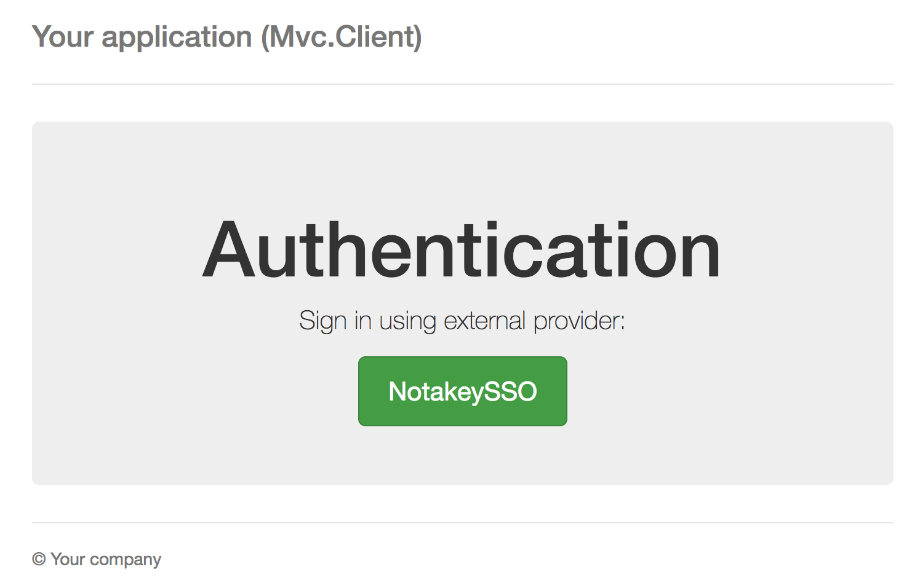
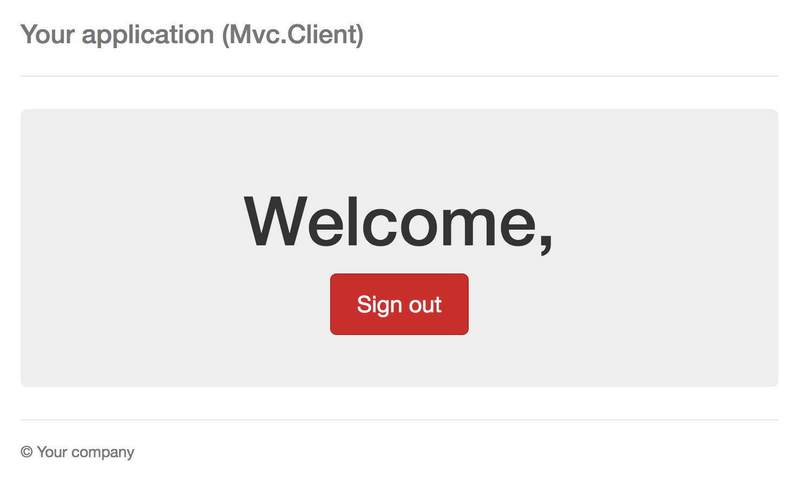

# Notakey SSO Oauth 2.0 example

## Running 

Run the application using `dotnet run` in project root or use Visual Studio.

## Requirements

To use it, you need:

- a SSO backend configured with at least one NAS endpoint
- an onboarded user, which can approve authentication requests in this application

## Screenshots

